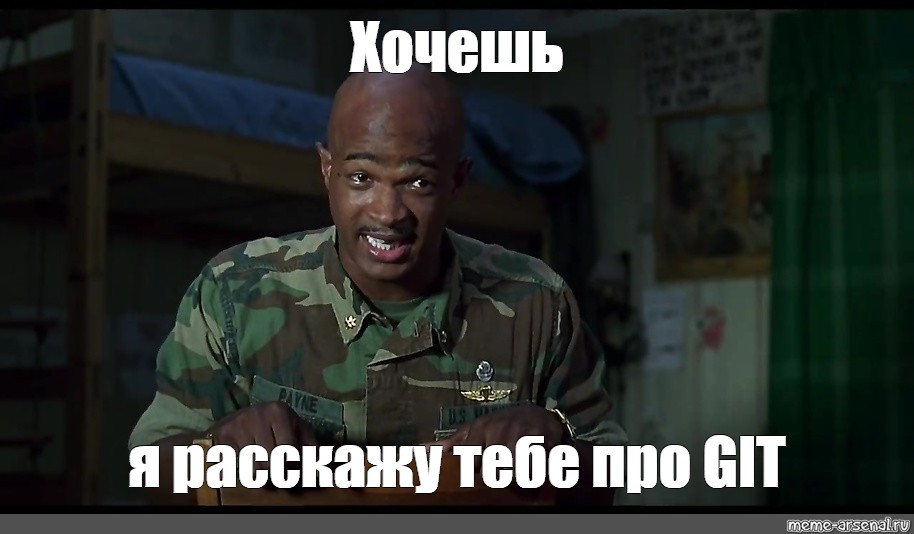
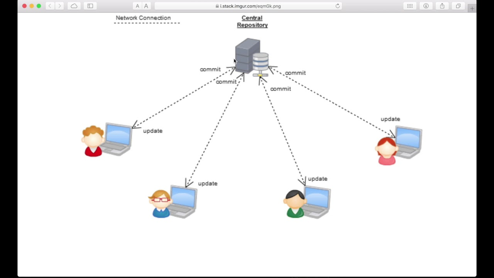
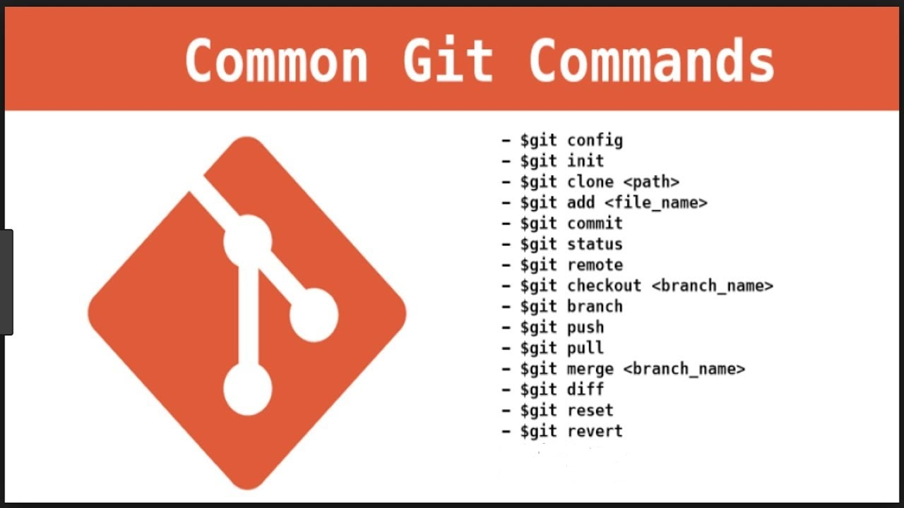

# Task4.14
# Инструкция по работе с GIT

LICENSE: [MIT](./license.md)

---

### Содержание:
1.Что такое GIT?
===============

 ***GIT*** - это распределённая система контроля версий,созданная Финно-Американским программистом Линусом Бенедикт Торвальдсом (англ. *Linus Benedict Torvalds*) ***7 апреля 2005 года***
 
 

 
 *GIT* появился при разработке операционной системы _Linux_.Основая потребность *git* была в тот момент в том,что разработчику,а именно _Линусу Торвальдсу_ было очень сложно оценивать и отслеживать то,что ему предлагают другие разработчики для операционной системы *Linux*. И он подумал,что было бы неплохо создать некую систему,которая сама записывала бы какой разработчик и какие предложения представил в проект.Таким образом появился _git_ и с тех самых пор,все разработчики используют _git_,чтобы обмениваться своим кодом,предлагать изменения,отслеживать ошибки и управлять версиями.  

  Переводя на простой язык *git*- это **специализированные утилиты**(или вспомогательные средства),которые позволяют **контролировать** тот код,проекты или программные обеспечения,которые мы хотим разрабатывать в виде отдельных версий,что позволяет хранить их в структурированном виде и иметь возможность просмотреть подробную историю,т.е. когда,какой разработчик,в какой момент времени внёс те или иные изменения.

В целом,вся эта систеиа позволяет нам манипулировать своим проектом как фильмом,т.е.можно перемотать назад-вперёд,нажать на стоп,или если что-то пошло не так,начать заново. Именно поэтому *Git*-это ***очень важный инструмент*** в нашей сфере._GIT_-это не просто система контроля версий,а ***распределённая система контроля версий***. Под Распределённой системой контроля версий подразумевается несколько точек взаимодействия,которые в целом объединяются на каком-то сервере или может быть в какой-то эко-системе.

На картинке изображён пример,как несколько разработчиков могут работать с одной гит-системой(гит-сервером) и впоследствии этот гит-сервер сможет своё некое хранилище сможет распаковывать или передавать на другие внешние сервера.

--------------

2.Основные команды GIT
===================

* [git config](./config.md)

* [git add](./add.md)

* [git clone](./clone.md)

* [git commit](./commit.md)

* [git init](./init.md)

* [git fetch](./fetch.md)

* [git merge](./merge.md)

* [git pull](./pull.md)

* [git push](./push.md)

* [git status](./status.md)

* [git remote](./remote.md)

* [git diff](diff.md)

* [git branch](./branch.md)

* [git checkout](./checkout.md)

---

GIT logo by Jason Long - http://git-scm.com/downloads/logos, license: [CC BY 3.0](https://creativecommons.org/licenses/by/3.0/)

